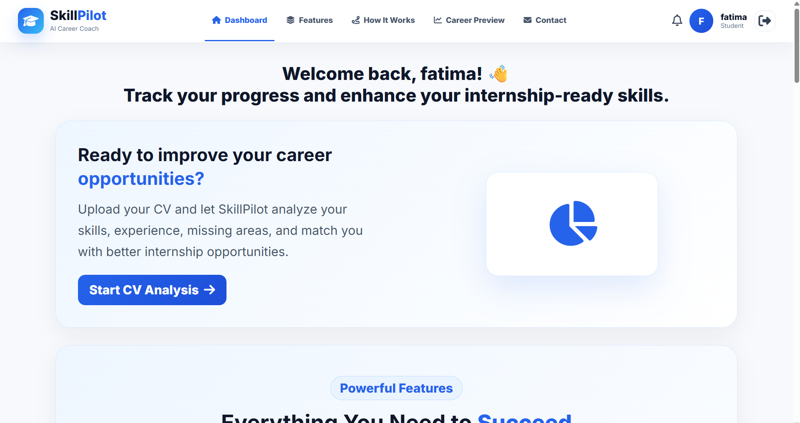
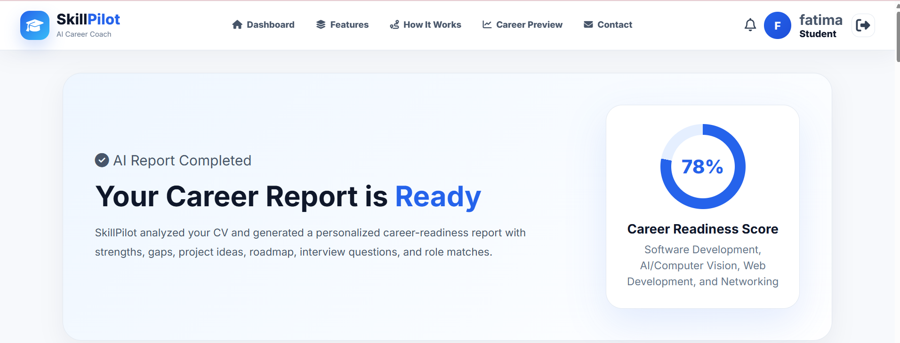
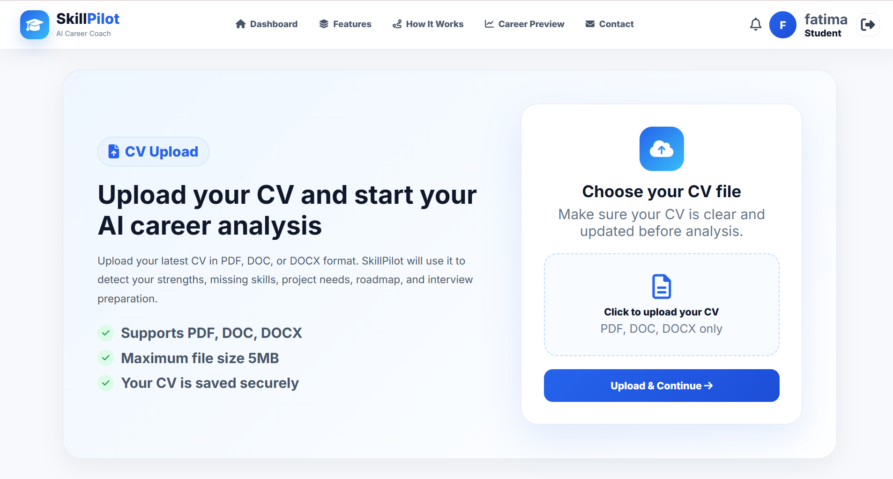
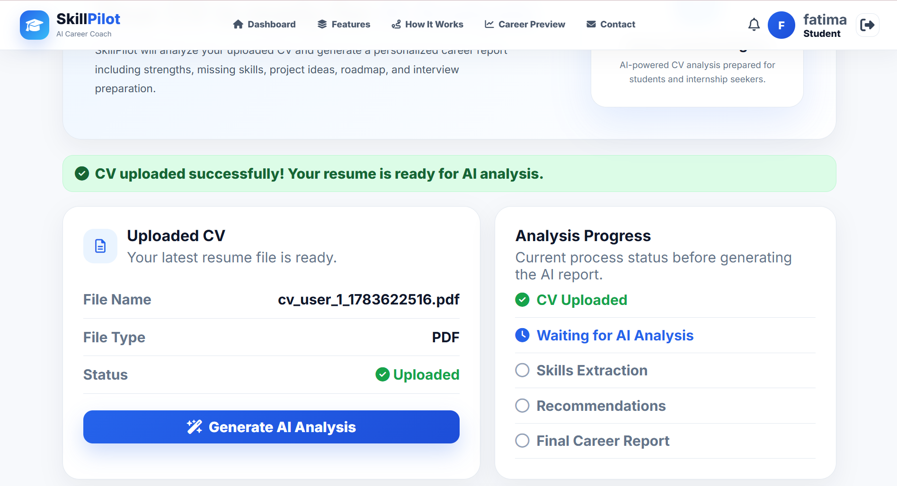
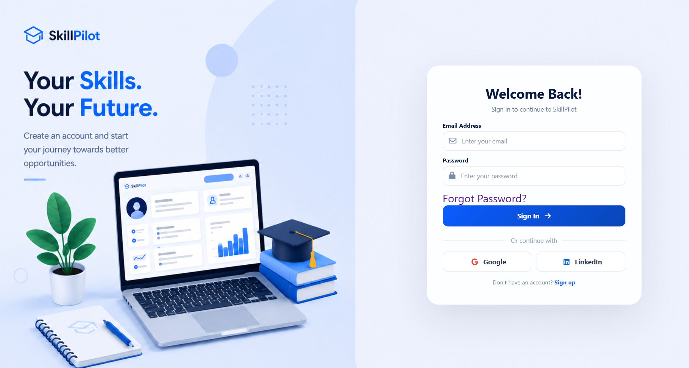
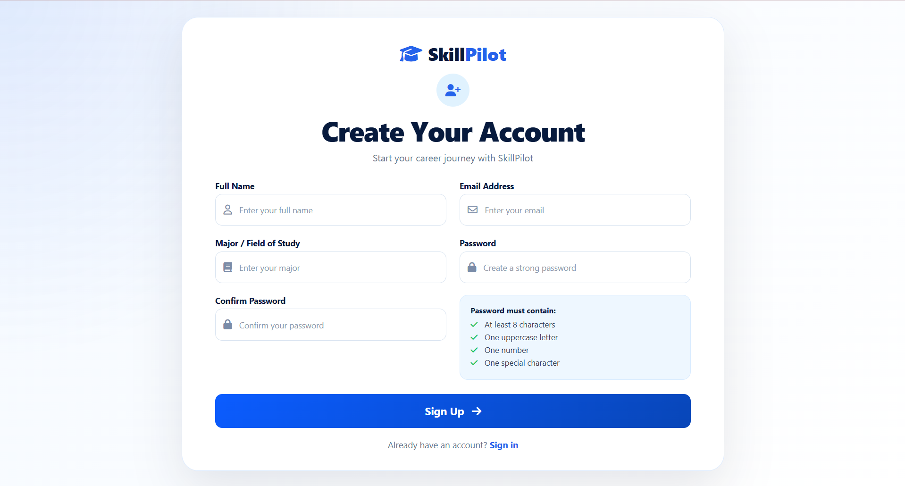
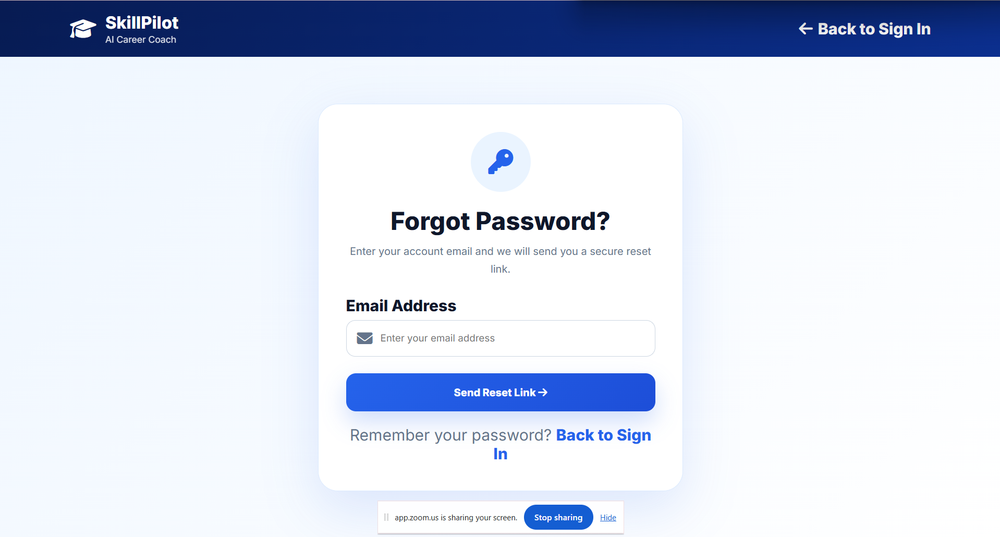

<p align="center">


</p>

# 🎓 SkillPilot – AI Career Coach

SkillPilot is an AI-powered career coaching web application designed to help students improve their career readiness.

The platform analyzes uploaded CVs using the OpenAI API and provides personalized career insights, including missing skills, project recommendations, internship suggestions, learning roadmaps, and interview preparation.

---

# 📸 Application Screenshots

### 🖥 Dashboard



---

### 🤖 AI Career Analysis Results



---

### 📄 CV Upload



---

### ⚙ Generate AI Analysis



---

### 🔐 Sign In



---

### 📝 Sign Up



---

### 🔑 Password Recovery



---

# 🚀 Project Highlights

- AI-powered CV analysis using OpenAI API
- Intelligent missing skills detection
- Personalized internship recommendations
- AI-generated project recommendations
- Customized learning roadmaps
- Technical interview preparation
- Career readiness assessment
- Secure authentication system
- Password recovery via email
- Responsive and modern user interface
- Structured MySQL database design

---

# 🎯 Problem Statement

Many students struggle to identify the technical skills required for internships and entry-level positions.

Traditional CV reviews are often generic, time-consuming, and do not provide personalized career guidance.

---

# 💡 Solution

SkillPilot automates CV analysis using Artificial Intelligence to generate personalized career recommendations.

The platform helps students understand their skill gaps, discover suitable internship roles, receive project ideas, prepare for interviews, and build personalized learning roadmaps.

---

# 🤖 AI Capabilities

The OpenAI API is used to generate intelligent recommendations based on the uploaded CV, including:

- Resume summary
- Missing skills analysis
- Career readiness assessment
- Internship recommendations
- Project recommendations
- Personalized learning roadmap
- Technical interview questions

---

# 🛠 Technologies Used

| Category | Technologies |
|-----------|--------------|
| Frontend | HTML5, CSS3, JavaScript, Font Awesome |
| Backend | PHP, MySQL, PHPMailer |
| Artificial Intelligence | OpenAI API |
| Development Tools | XAMPP, Composer, VS Code |

---

# 📂 Project Structure

```text
SkillPilot/
│
├── assets/
│   ├── css/
│   ├── images/
│
├── auth/
│
├── includes/
│
├── pages/
│
├── uploads/
│
├── screenshots/
│
├── composer.json
├── composer.lock
├── README.md
├── .gitignore
└── .env.example
```

---

# 🔒 Security

- Password hashing using PHP password hashing functions
- Secure PHP sessions
- Prepared SQL statements
- Environment variables using `.env`
- Password reset tokens
- Email verification using PHPMailer

---

# 🚀 Installation

## 1. Clone the repository

```bash
git clone https://github.com/FCHGIT93/SkillPilot.git
```

---

## 2. Install Composer dependencies

```bash
composer install
```

---

## 3. Configure the environment variables

Create a `.env` file:

```env
OPENAI_API_KEY=

MAIL_HOST=smtp.gmail.com
MAIL_PORT=587
MAIL_USERNAME=
MAIL_PASSWORD=
MAIL_FROM_NAME=SkillPilot
```

---

## 4. Configure the database

Import the SQL database into MySQL and update your database credentials inside:

```text
includes/db.php
```

---

## 5. Run the project

- Start Apache
- Start MySQL
- Open:

```
http://localhost/SkillPilot
```

---

# 📋 Main Modules

- User Authentication
- Dashboard
- CV Upload
- AI CV Analysis
- Career Readiness Assessment
- Missing Skills Analysis
- Internship Recommendations
- Project Recommendations
- Learning Roadmap
- Interview Preparation
- Password Recovery

---

# 🔮 Future Roadmap

- Google OAuth Authentication
- LinkedIn OAuth Authentication
- AI Resume Scoring
- Personalized Job Matching
- Real-time Notifications
- Career Progress Tracking
- Multi-language Support
- Admin Analytics Dashboard

---

# 👩‍💻 Author

**Fatima Chakaron**

Computer & Communication Engineering Student

Passionate about Artificial Intelligence, Backend Development, and Intelligent Web Applications.

- GitHub: https://github.com/FCHGIT93
- LinkedIn: https://www.linkedin.com/in/fatima-chakaron-016798349/

---

# 📌 About This Project

SkillPilot was developed as a portfolio project to demonstrate practical full-stack web development skills, AI integration, secure authentication, database design, and backend engineering through a real-world career coaching platform.
